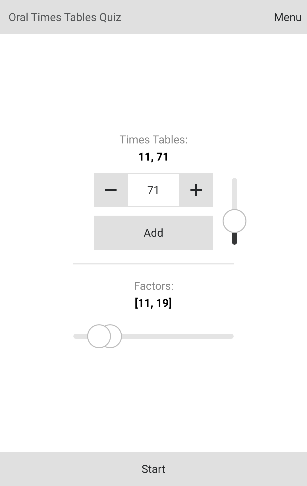
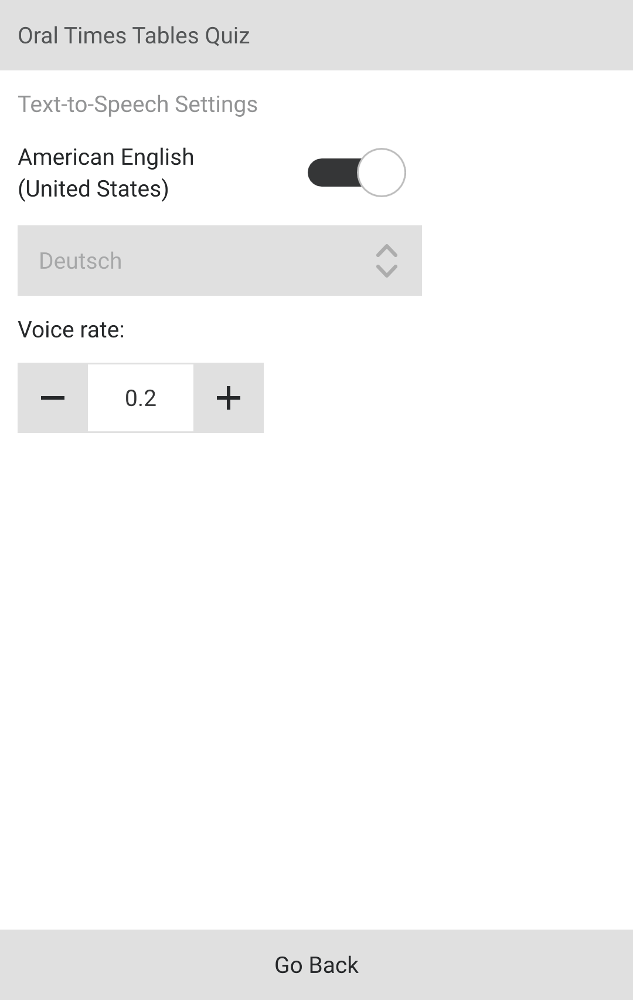

# Oral Times Tables Quiz

This is an app that asks times tables up to 100 x 100. It should run on the platforms supported by Qt 6.7; so far I built it for Android (lowest 8.0) and Ubuntu 24.04.

  
  
  

